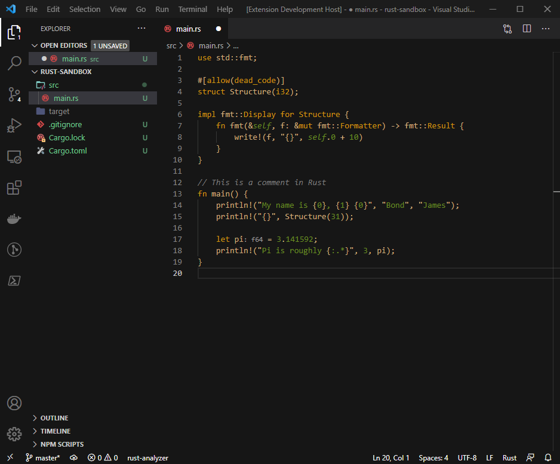

# Handmade Dark

This extension adds a dark theme inspired based on Casey Muratoris theme used in eMacs and 4Coder.

## NOTE

This theme is very much in its beginning phases, and this is my first pass at a VSCode extension so there could be
weird inconsitencies between languages

## Screenshot

## Usage

Select the theme and go!

## Installation

1. Open **Extensions** sidebar panel in Visual Studio Code. `View → Extensions`
1. Search for `Handmade Dark`
1. Click **Install**
1. Click **Reload**
1. File > Preferences > Color Theme > **Handmade Dark**

## Feedback

If you have suggestions, please [open an issue](https://github.com/davidaburns/handmade-dark/issues) or better yet, a [pull request](https://github.com/davidaburns/handmade-dark/pulls).

Be nice.

## Authors

Authored by [David Burns](https://github.com/davidaburns)
